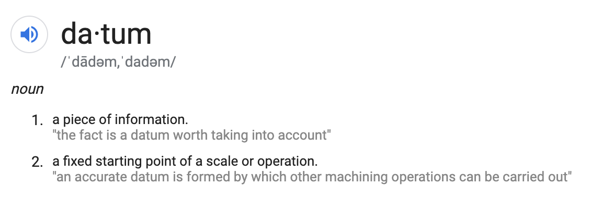

# `datum` v 0.0.5

Ingest and generate queries of large databases.



The repo is located [here](https://github.com/schnappv/datum)

-----------

## About
A package to ingest a large csv file into a SQLIte database, and return a 
pandas data frame of a specified query. This query must be a `sqlalchemy` 
select function, but can be converted easily from SQLite using the `sql` 
function. The `sql` function pulls from the `sqlitis` package which has been
pulled into this repository for usage outside of the command line.

More about the `sqlitis` package can be found [here](https://github.com/pglass/sqlitis).

-----------

## Quickstart

```bash
pip install -r requirements.txt

python setup.py install
```
------------

## Usage

There are 2 main usages of this package: __create__ and __access__

### 1.   Create

Ingest a large CSV file into a SQLite database using the `create_db` function

- Parameters needed: 
    - `file_name`: the name of the csv file. As of now, `datum` only takes in csv files, not excel files.
    - `db_name`: the name of the database you want to make
    - `table_name`: the name of the database table you are generating
    - `data_loc`: a wrapper function pointing to the location in which you are storing the data

- Features:
    - Date parsing function (`is_date`) which will automatically turn text columns filled with dates into timestamps.
    - Default data location (`default_data_loc`) which will put the generated data in a folder `./datum/data`. 

- Example:

        # imports
        from datum.create import create_db

        # parameters
        file_name = "athlete_events.csv"
        db_name = "data.db"
        table_name = "IOC"

        def data_loc(file_name):
            pardir = Path(__file__).parents[0]
            return os.path.join(pardir, "example", file_name)

        # code implementation

        create_db(file_name, db_name, table_name, data_loc)

_Note_: Add your data location folder into the `.gitignore` and make sure that
the CSV file is in there before generating the database. The current example data was taken from the `datum/tests` folder.

### 2.   Access

Access and query the database using the `Access` class

- Class parameters:
    - `data_base`: the file path of the database
    - `table_name`: the name of the table you want to access

- SQL conversion parameters:
     - `sql_q`: the SQLite query as a string
     - `a`: the Access class object being used

- Methods:
    - `Access.query()`: queries the object based off on SQLite select command and returns a `pandas` dataframe for usage
    - `Access.db_properities`: returns the engine and connection being used

- Example:

        # imports
        from datum.access import Access, sql

        # parameters
        data_base = data_loc(db_name)
        table = "IOC"
        sqlite_q = "SELECT Age, Sex FROM IOC WHERE IOC.Sex = F"

        # code implementation
        a = Access(data_base, table)
        query = sql(sqlite_q, a)

        queried_data = a.query(query)


-------------

## Test

To run tests: 

```bash
py.test -v
```

If you're on Windows

```bash
python -m pytest -v
```

Note: the first time you test, it will take about a minute due to generating a database as it tests. After it is there, it will only take less than a second to test.

--------------

## Feature Requests and Bug Reporting

Please open an issue on GitHub.

--------------

## Authors

- [Valerie Schnapp](valerie.f.schnapp@gmail.com) - Repo Owner / Architect

- __Sqlitis Author__: Paul Glass